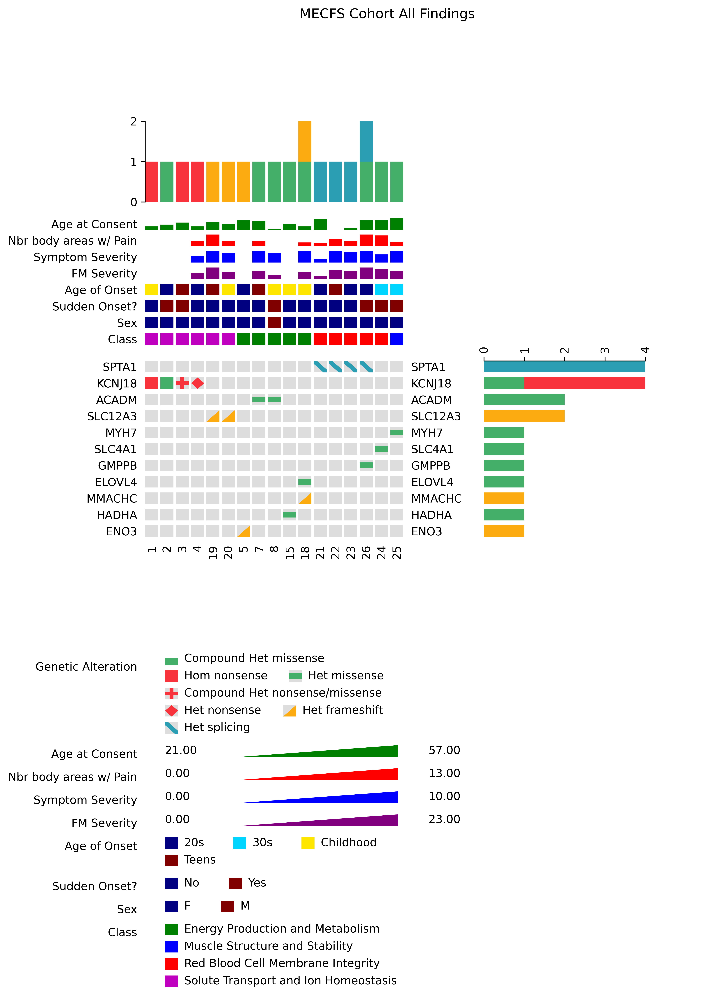

# MECFS Cohort Primary Findings Variant Plot

A simple representation of the primary variant findings for MECFS cohort.

## Requirements

Anaconda3 (miniconda3) or Mamba

## How to install

Create a conda environment with all dependencies installed

```sh
cd variant-findings-plot
conda env create -f configs/env.yml
```

Activate the environment to run the notebook

```sh
conda activate pyoncoprint
```

## How to run

Open the [Jupyter notebook](notebooks/mecfs_oncoprint.ipynb),
[start the notebook server](https://docs.jupyter.org/en/latest/running.html) in the conda
environment and run the enitre notebook or specific desired sections of the notebook.

## Results

### Code generated figure



### Final edited figure

Editing to achieve this format was done by hand using Google Images and
moving parts of the code generated image around to use space better.
The editing was done much quicker by hand as opposed to trying to achieve
the same in the codebase.


